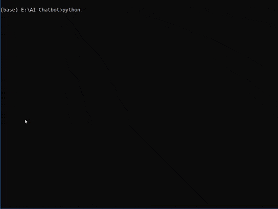
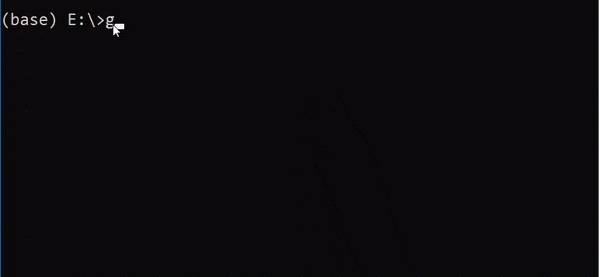
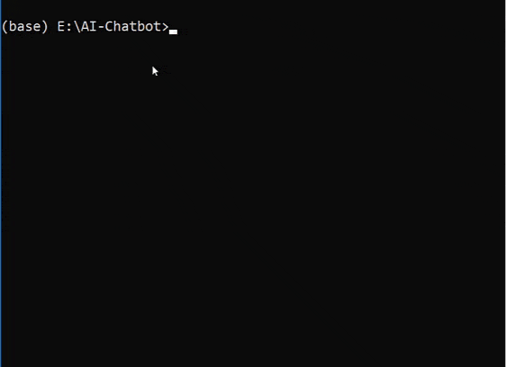

> Simple AI chatbot built using chatterbox

# AI-chatbot

---

Chatbots are getting amazing, they are now taking over the world. They provide an easy interface for user to interact. Using chatbots users feel more engaged and feel more comfortable as compared to solid user interfaces.

Building chatbots are now just a piece of cake and this repository shows how you can build a fully featured chatbot with minimal effort. Using the amazing [chatterbox](https://github.com/gunthercox/ChatterBot) engine, I have built a simple chatbot to chat with, using openly available conversational statements.

---

## Usage

**Clone the repository**

```
git clone https://github.com/Reepulse/AI-Chatbot.git
```



> Cloning the repository locally

----

**Installing the required packages**

```bash
pip install -r requirements.txt
```

OR

```bash
pip install chatterbot chatterbot-corpus text-distance
```

---

**Training the chatbot**

```bash
python train-bot.py
```



> Training the bot

Note: If you got `chatterbox module not found` error, check your `$PYTHONPATH` variable

---

**Usage**

```bash
python bot.py
```

And now bot is ready to chat with you


> Initializing the bot

---

